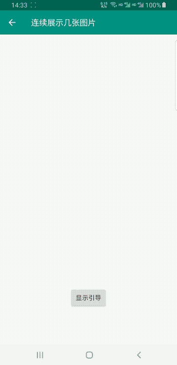

# AppGuide
author:yfengtech
version:1.0.0
## 摘要
可定制化实现引导功能

1. 对指定控件实现高亮效果
2. 在指定控件周围加上说明文字
3. 维护引导列表，通过Api调用顺序展示
4. 无入侵，不需要在界面内增加布局
5. 直接显示一个自定义view在界面上
6. [更多](./document/SUMMARY.md)

## 设计
* 通过windowManager来创建window显示引导，无入侵式设计并保证界面层级优先
* 检测判断高亮元素，自定义view计算出高亮位置，显示在window的最底层
* 根布局继承字约束布局`ConstraintLayout`实现控件间的位置设置
* [更多](./document/DESIGN.md)

## 依赖
```groovy


```
## 演示

| 描述 | gif | 描述 | gif |
| :---: | :---: | :---: | :---: |
| 单个界面引导多个高亮控件 |  | 连续显示多张图片 |  |
| 修改引导高亮控件的位置 |  | 监听引导页生命周期 |  |


## 基础概念
展示引导页入口方法使用了kotlin特性，需使用DSL动态配置  
配置如下：  

```
Guide：本次展示引导页的最外层配置，内部可放多个引导页 
	Scene：Guide内部的子元素，可以有多个，每一个元素表示一层引导页，显示和隐藏都是以Scene为单位
		action: 当前引导页的唯一标识，用来判断仅首次显示
		Element：抽象类，具体实现是ViewElement，HighLightingElement，Scene内部的子元素，表示Scene引导页层内部的元素，可配置多个，会同时显示出来
		ViewElement：Scene内部子元素，自定义View层,用来展示自定义View
			view：传入自定义的view
		HighLightingElement：Scene内部子元素，标识高亮层
			anchorViewIdArray：viewId数组，根据传入id，在显示引导时高亮view
		onGuideSceneClick：点击监听，点击了这层引导页时触发
```

## 使用
### 入口类--AppGuide
| 返回值 | 描述 |
| :---: | :---: |
| GuideController | AppGuide.with(context:Context)<br>返回一个GuideController对象 |
| GuideController | AppGuide.with(fragment:Fragment)<br>返回一个GuideController对象 |

### 核心类--GuideController
| 返回值 | API|描述 |
| :---: | :---: | :--- |
| GuideController | setOnlyFirst(onlyFirst: Boolean) | 引导是否只展示一次<br>参数true表示只展示一次<br>参数false每次调用都会展示 |
| GuideController | setOnGuideChangeListener(listener: OnGuideChangeListener) | 设置监听器，监听引导页的显示和隐藏 |
| GuideController | setOnGuideBackClickListener(listener: OnGuideBackClickListener)| 设置监听器，监听当引导页显示的时候，back键的点击<br>默认实现是点击点击返回键，关闭当前引导页 |
| void | startGuide(guide: Guide.() -> Unit)| 显示引导的入口方法，此处支持传入多个引导页，依次展示 |
| void | startGuide(guide: Guide)| 可以实现一个继承Guide的类传入，减少内部类的使用 |
| void | startGuideScene(guideScene: GuideScene.() -> Unit)| 直接显示一个单一的引导页面 |
| void | startGuideScene(guideScene: GuideScene)| 可以实现一个继承GuideScene的类传入，减少内部类的使用 |
| Boolean | showNext()| 显示下一个引导页<br>返回值true表示有下一个引导页，并且已经展示出来了<br>返回值false表示没有可展示的引导页了 |
| void | dismissCurrent()| 暂时隐藏正在显示的引导页 |
| void | removeAll() | 移除当前引导页，并移除之前的所有引导页配置 |

### Sample（推荐使用方式）
#### 自己实现一个Guide

```kotlin
class ImageGuide(context: Context) : Guide() {
    init {
        addScene(OcrImageGuideScene(context))

        addScene(Sample1GuideScene(context))
        
        scene { 
            ...
        }
    }
}

// 调用
AppGuide.with(this).startGuide(ImageGuide(context))
```

#### 自己实现一个GuideScene

```kotlin
class SampleGuideScene(context:Context) : GuideScene(){
    init {
        action = "action_image"
        viewElement {
            this.view = ImageView(context).apply {
                setImageResource(R.mipmap.img_guide)
            }
            this.lparams = FrameLayout.LayoutParams(
                FrameLayout.LayoutParams.WRAP_CONTENT,
                FrameLayout.LayoutParams.WRAP_CONTENT
            ).apply {
                gravity = Gravity.CENTER
            }
        }
        onGuideSceneClick {
            AppGuide.with(context).showNext()
        }
    }
}

// 调用
AppGuide.with(this).startGuideScene(SampleGuideScene(context))
```